# 🚀 YÖN: Hedefine Doğru

- [Genel Bilgiler](#genel-bilgiler)
- [Sprint Bilgileri](#sprint)

---

## ℹ️ Genel Bilgiler

Ürünümüz Hakkında Bilgiler

| İsim Soyisim       | Görev                     |
| :----------------- | :------------------------ |
| Sinem ARSAL        | Developer                 |
| Furkan ÖZTEKİN     | Product Owner / Developer |
| Yusuf KURNAZ       | Developer                 |
| Emir Efe YURTSEVEN | Developer                 |
| Sercan Ümit ÖNER   | Scrum Master / Developer  |

- **Ürün İsmi:** **YÖN: _Hedefine Doğru_**
- **Backlog URL:** [GitHub Projects](https://github.com/users/sercanumit/projects/2)
- **Ürün Açıklaması:**  
  Üniversite sınavına hazırlanan öğrenciler için geliştirilen bu uygulama; öğrencilerin her dersten soru çözebileceği, eksik konularını görebileceği ve yapay zeka destekli koçluk hizmeti alabileceği bir dijital eğitim asistanıdır.

- **Ürün Özellikleri:**

  - Öğrencinin performansına göre uyarlanmış dashboard
  - Günlük özgün sorular ve analiz desteği
  - Konu testleri, çıkmış sorular, zor soru köşesi
  - AI destekli koçluk sistemiyle kişisel öneriler

- **Hedef Kitle:**  
  Türkiye'de üniversiteye hazırlanan lise öğrencileri (özellikle 11. ve 12. sınıf) ve mezun adaylar

- **Jüriye Not :**  
  Üniversiteye hazırlık süreci, öğrenciler arasında ciddi eşitsizliklerin yaşandığı bir alan.  
  Özel dersler, etüt merkezleri ve kaliteli kaynaklara erişim imkânı olmayan onbinlerce öğrenci, yalnızca bu sebeplerle potansiyelini tam olarak ortaya koyamıyor.

  Geliştirdiğimiz uygulama, bu eşitsizliği azaltmayı hedefliyor.  
  Tüm öğrencilere **ücretsiz ve kişiselleştirilmiş rehberlik**, **nitelikli soru içerikleri**, ve **yapay zeka destekli koçluk sistemi** sunarak eğitimde fırsat eşitliğini güçlendirmeyi amaçlıyoruz.

  Özellikle dezavantajlı bölgelerde yaşayan ya da özel destek alma imkânı olmayan öğrencilerin sınav sürecini daha verimli geçirmelerine olanak tanıyan bu proje, sadece akademik başarıyı değil, **adil bir gelecek** inşa etmeyi de hedeflemektedir.

---

## 🏁 Sprint Raporu

### Sprintler

- [1. Sprint](#1-sprint)
- [2. Sprint](#2-sprint)
- [3. Sprint](#3-sprint)

1. Sprint

##### Sprint Tarihleri

- Başlangıç: 20.06.2025
- Bitiş: 06.07.2025

#### Sprint Notları

- Bu sprintte öncelikle takım olarak tanıştık ve proje fikrimizi netleştirdik. Kodlamaya geçmeden önce backlog’umuzu oluşturduk. İşleri önceliklendirmek için P0 (kritik), P1 (öncelikli), P2 (bekleyebilir) şeklinde etiketledik. Story point puanlamasını ise Fibonacci dizisine göre yaptık.

#### Sprint İçinde Tamamlanması Tahmin Edilen Puan

- **Tahmini Puan:** 26
- **Açıklama:** Bu sprintte, takım değişikliği göz önüne bulundurularak toplam **26 story point**'lik işin tamamlanması planlanmıştır.

#### Puan Tamamlama Mantığı

- Takım değişikliği nedeniyle bu sprintte bir haftalık kayıp yaşanmıştır. Bu durum göz önüne alınarak 26 story point'lik iş planlanmıştır. Toplam hedef 150 puandır ve kalan sprintlerde bu hedefe ulaşmak için ek çalışmalar yapılacaktır.

### Daily Scrum

İlk olarak takım içi tanışma ve haberleşme amacıyla Slack üzerinden iletişim kurmaya çalıştık.  
Slack Huddle özelliğini kullandık ancak zamanlama uyuşmazlıkları nedeniyle herkesin aynı anda buluşması zor oldu.

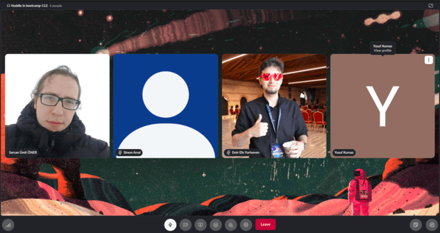

Bu nedenle daha hızlı ve esnek iletişim sağlayabilmek adına WhatsApp grubuna geçiş yaptık.  
Proje hakkında fikir alışverişi ve karar süreçlerini burada sürdürdük.

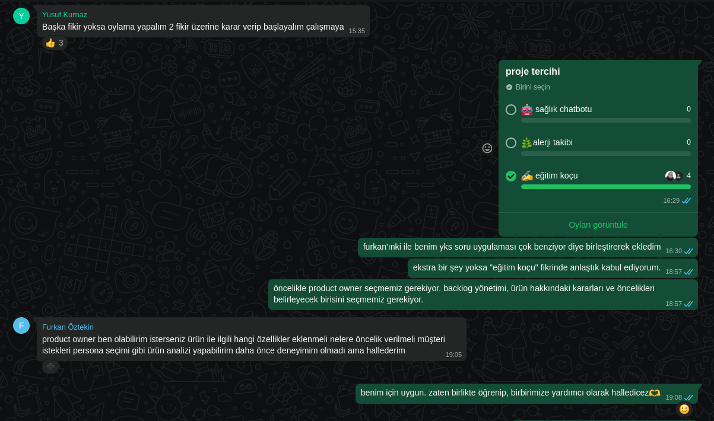  
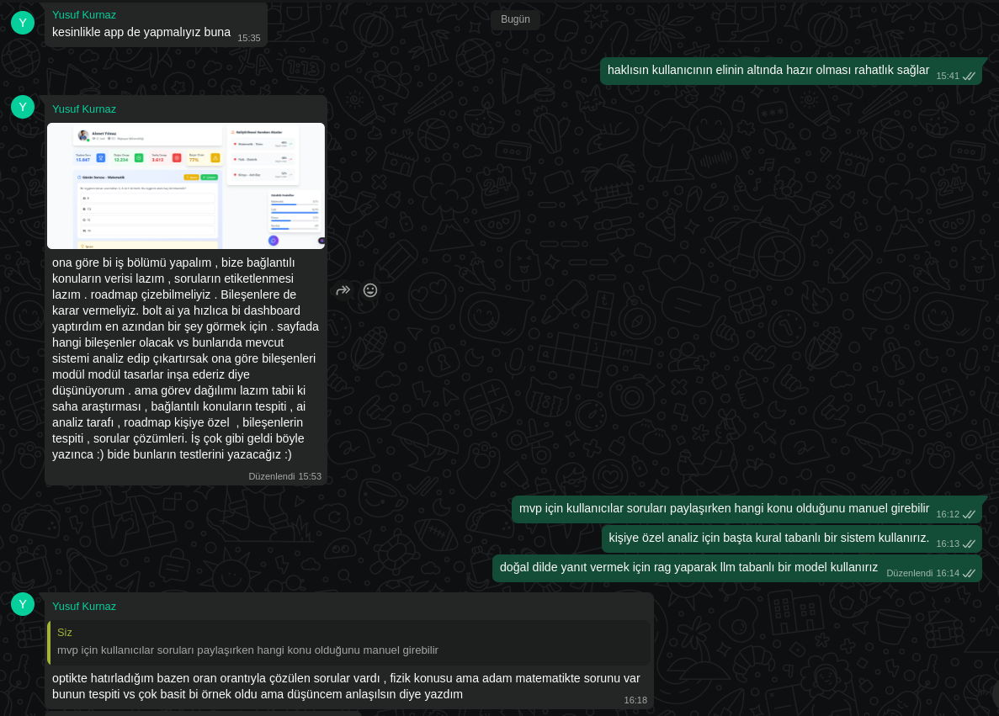

#### Sprint Board Screenshotları

Görsel 1

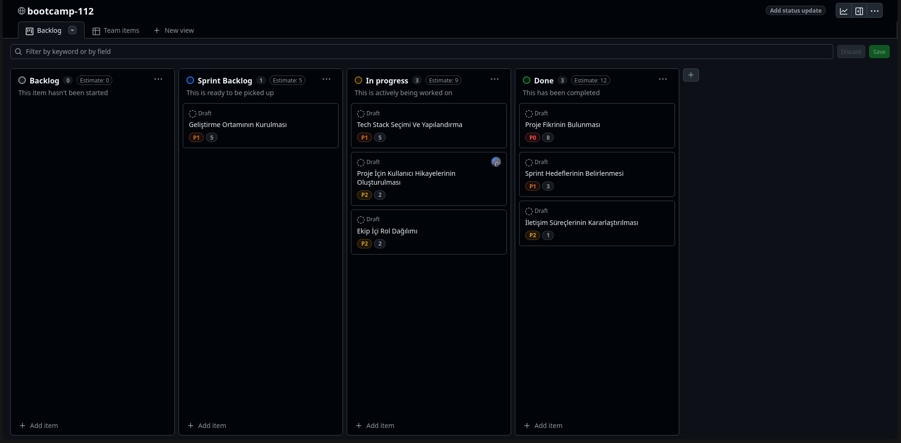

### Ürün Durumu: Ekran Görüntüleri

Kodlama aşamasına henüz geçilmediği için elimizde ürünün çalışan bir ekran görüntüsü bulunmamaktadır.  
Ancak, proje fikrimizi somutlaştırmak adına **konsept tasarımlar** hazırladık.

Görseller

#### 🖥️ Web Görünümü

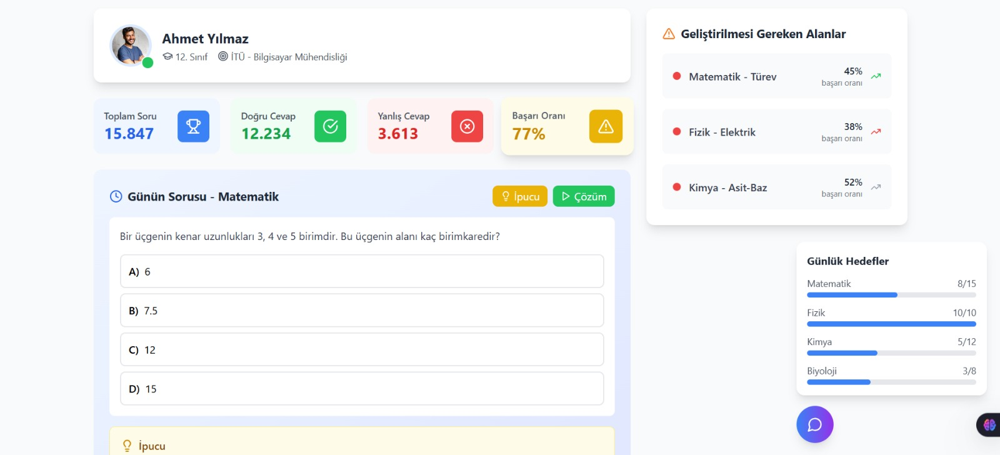

#### 📱 Mobil Görünüm

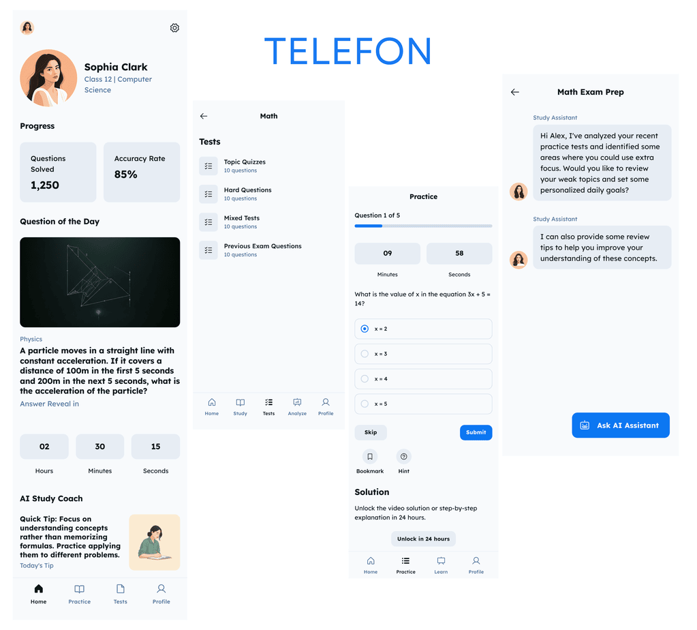

#### Sprint Review

- Yeni takım üyeleri sprintin ikinci yarısında dahil oldu. Bu nedenle yazılım geliştirme faaliyetlerine henüz başlanamadı.
- Sprint süresince takım üyeleri tanıştı, iletişim kanalları (Slack, GitHub, vs.) kuruldu.
- Proje fikri netleştirildi, hedef kullanıcı kitlesi, temel özellikler üzerine fikir birliği sağlandı.
- Konsept tasarımlar ile ürün fikri somutlaştırıldı ve ön prototip fikirleri oluşturuldu.

#### Sprint Retrospective

- Takıma sonradan katılmamıza rağmen hızlı adapte olduk ve verimli bir tanışma süreci geçirdik.
- İletişim konusunda güçlü bir başlangıç yaptık; herkes sorumluluk almaya açık davrandı.
- Sürenin kısıtlı olması nedeniyle teknik üretim (kodlama, test vs.) gerçekleştiremedik.
- Önümüzdeki sprintte proje görevlerine geçiş yapılması için gerekli temel (rol paylaşımı, fikir netliği, proje hedefi) sağlandı.
- Gelecek sprintte daha gerçekçi planlama ve zaman yönetimi yapılması gerektiğini fark ettik.
- Süreç içerisindeki belirsizlikleri daha hızlı netleştirmek için karar alma süreçleri iyileştirilebilir.

2. Sprint

##### Sprint Tarihleri

- Başlangıç: 07.07.2025
- Bitiş: 20.07.2025

#### Sprint Notları

- Bu sprintte React Native ile mobil uygulama geliştirme sürecine başlandı. Öncelikli olarak uygulamanın ana ekranı olan **Dashboard** arayüzü tasarlandı ve kodlandı.
- Backend tarafında **Firebase ve Django** kullanarak hibrit bir altyapı oluşturma çalışmaları başladı. Soruların resim olarak yüklenip metne dönüştürülerek **Gemini AI**'a gönderilmesi için bir akış tasarlandı.
- Veritabanı tarafında konular, sınav türleri (TYT/AYT) ve öğrenci yol haritası (roadmap) için modelleme ve yapılandırma araştırmaları yapıldı.

#### Sprint İçinde Tamamlanması Tahmin Edilen Puan

- **Tahmini Puan:** 55
- **Açıklama:** Bu sprintte, takımın tam zamanlı çalışmaya başlamasıyla birlikte **55 story point**'lik işin tamamlanması hedeflenmiştir. Ancak takım içi katılım sorunları nedeniyle hedefe ulaşılamamıştır.

#### Puan Tamamlama Mantığı

- Toplam 150 puanlık hedefin ilk sprintte 24’ü tamamlandı. Kalan 126 puanı iki sprinte eşit (63’er puan) bölmeyi planladık. Ancak katılım eksikliği nedeniyle bu sprintte hedef 55 puana düşürüldü. Yine de yalnızca Sercan ve Yusuf aktif çalışabildiği için bu hedefe ulaşılamadı.

### Daily Scrum

- Daily Scrum toplantıları ağırlıklı olarak WhatsApp üzerinden yazılı olarak yapıldı. Gerekli durumlarda Slack üzerinden görüntülü görüşmeler düzenlendi.
- Yusuf ve Sercan, uygulama fonksiyonları ve tasarımları üzerine ortak bir şekilde çalıştı.

Görsel 1

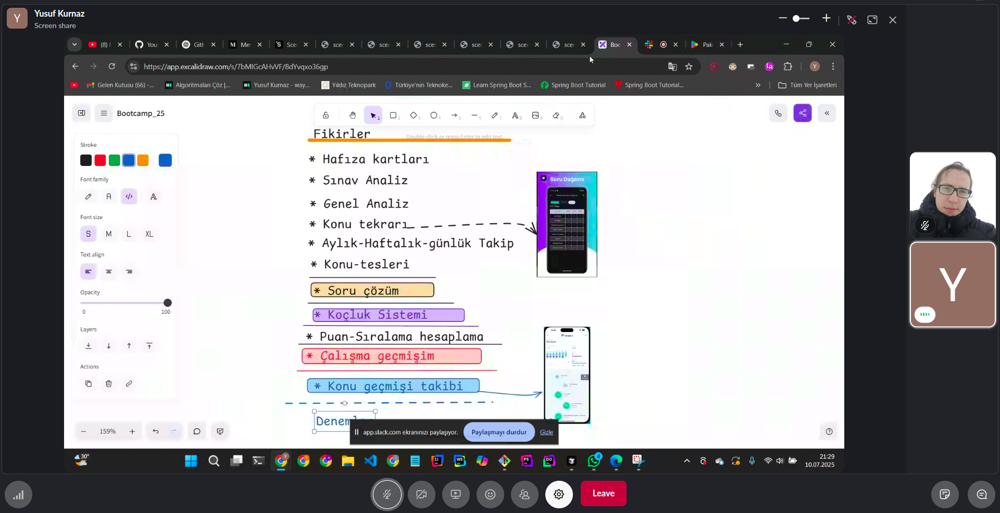

#### Sprint Board Screenshotları

Görsel 1

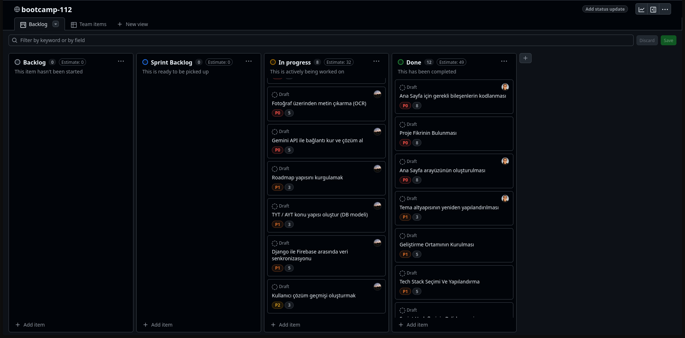

### Ürün Durumu: Ekran Görüntüleri

Bu sprint itibarıyla kodlama aşamasına geçilmiştir. Mobil uygulamanın ilk ekranları ve temel bileşenleri geliştirilmiştir.

Görseller

#### 📱 Mobil Uygulama

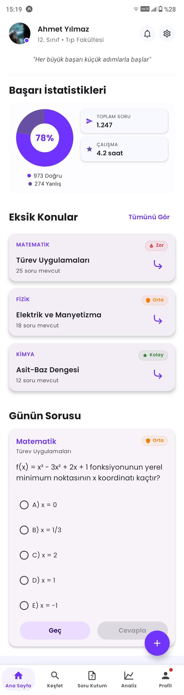

#### Sprint Review

- Sprint başında hedeflenen 55 story point'lik işin bir kısmı, aktif çalışan ekip üyelerinin çabasıyla tamamlanabildi.
- **Dashboard tasarımı ve kodlaması** başarıyla tamamlandı.
- Takım üyelerinden Furkan'ın kişisel işleri nedeniyle katılımı sınırlı oldu. Sinem ve Emir Efe ise sprinte hiç dahil olamadı. Bu durum, sprint hedeflerine ulaşılmasını engelledi.
- Backend tarafında ise Firebase ve Django hibrit yapısı için temel hazırlıklar yapıldı.

#### Sprint Retrospective

- Takımın tamamının sürece dahil olamaması, sprint planlamasının ve hedeflerin gerçekçiliğini sorgulattı. Gelecek sprintlerde **rol ve sorumlulukların** daha net belirlenmesi gerektiği anlaşıldı.
- WhatsApp üzerinden yapılan günlük güncellemeler hızlı olsa da, karmaşık konular için Slack veya yüz yüze toplantıların daha verimli olduğu görüldü.
- Gelecek sprint için takımın katılım durumuna göre daha **gerçekçi bir hedef** belirlenmesi kararlaştırıldı.

3. Sprint

##### Sprint Tarihleri

- Başlangıç: 21.07.2025
- Bitiş: 03.08.2025

#### Sprint Notları

- Bu sprintte kapsamlı backend geliştirme çalışmaları gerçekleştirildi. **Notifications (Bildirimler)**, **Quick Solutions (Hızlı Çözümler)**, **MindMaps (Zihin Haritaları)** ve **Flashcards** modülleri backend'de tam olarak kodlandı ve API endpointleri hazırlandı.
- Django tabanlı backend altyapısı güçlendirildi ve Firebase entegrasyonu tamamlandı. **Gemini AI** entegrasyonu ile kullanıcıların sorularına otomatik çözüm üretme sistemi geliştirildi.
- Mobil uygulama tarafında yeni ekranlar ve bileşenler eklendi. **AI destekli zihin haritası oluşturma**, **bildirim sistemi**, **hızlı soru çözümü** gibi core özellikler UI/UX ile birlikte tamamlandı.

#### Sprint İçinde Tamamlanması Tahmin Edilen Puan

- **Tahmini Puan:** 75
- **Açıklama:** Bu sprintte, proje teslim tarihine yaklaşıldığı için **75 story point**'lik yoğun bir iş planlandı. Yalnızca Sercan ve Yusuf'un aktif katkısıyla büyük oranda hedefe ulaşıldı.

#### Puan Tamamlama Mantığı

- İlk iki sprintte toplam 79 puanlık iş tamamlanabildi. Kalan 75 puanın bu final sprintinde tamamlanması hedeflendi. Takım üyelerinin çoğunun katılım sağlayamaması nedeniyle sadece iki kişiyle yoğun çalışma yapılarak hedefe ulaşılmaya çalışıldı.

### Daily Scrum

- Daily Scrum toplantıları yine WhatsApp üzerinden yazılı olarak sürdürüldü. Teknik sorunlar ve özellik geliştirmeleri konusunda sürekli iletişim halinde kalındı.

#### Sprint Board Screenshotları

Görsel 1

### Ürün Durumu: Ekran Görüntüleri

Bu sprint itibarıyla projenin core özellikleri büyük oranda tamamlanmıştır. Backend API'leri çalışır durumdadır ve mobil uygulamanın temel işlevleri geliştirilmiştir.

📱 Mobil Uygulama Ekran Görüntüleri

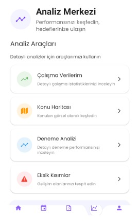
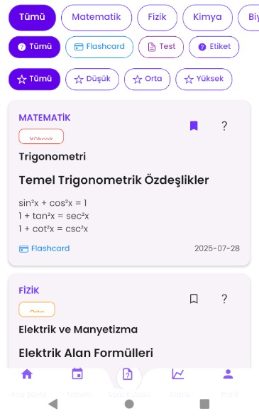

#### Tamamlanan Özellikler

**Backend Geliştirmeleri:**

- ✅ Notifications (Bildirimler) sistemi ve admin paneli
- ✅ Quick Solutions (Hızlı Çözümler) API'leri ve Gemini AI entegrasyonu
- ✅ MindMaps (Zihin Haritaları) oluşturma ve görüntüleme
- ✅ Flashcards modülü temel yapısı
- ✅ Firebase Authentication ve Firestore entegrasyonu
- ✅ Django Admin panel konfigürasyonları

**Mobil Uygulama Geliştirmeleri:**

- ✅ AI destekli zihin haritası oluşturucu ekranı
- ✅ Zihin haritası görüntüleyici (interaktif node sistemi)
- ✅ Bildirim önizleme modalı ve yönetim sistemi
- ✅ Hızlı soru çözümü modalı (kamera ile soru çekme)
- ✅ Flashcard kutusu temel arayüzü
- ✅ Dashboard üzerinde bildirim entegrasyonu

#### Sprint Review

- Bu sprintte **backend altyapısı büyük oranda tamamlandı**. Django modellerinden API endpointlerine kadar tüm temel yapı hazır durumda.
- **Gemini AI entegrasyonu** başarılı şekilde gerçekleştirildi. Kullanıcılar artık soru fotoğrafı yükleyerek AI destekli çözüm alabilir.
- **Zihin haritası oluşturma** özelliği hem backend hem de mobil tarafta tam olarak çalışır durumda.
- Takım üyelerinden **sadece Sercan ve Yusuf aktif** katılım sağladı. Diğer üyeler sprint boyunca hiç dahil olmadı.
- Proje **ana özellikler bakımından büyük oranda tamamlandı** ancak polish ve test süreçleri için daha fazla zamana ihtiyaç var.

#### Sprint Retrospective

- **İki kişilik takımla** bu kadar kapsamlı çalışma yapmak zorlu oldu ancak başarılı sonuçlar elde edildi.
- **Proje yönetimi** konusunda daha sıkı takip gerektiği ve **takım katılımının** kritik önem taşıdığı anlaşıldı.
- **Teknik debt** oluşmaması için kod kalitesi ve dokumentasyon konularına dikkat edildi.
- **AI entegrasyonları** beklenenden daha başarılı çalıştı ve kullanıcı deneyimini önemli ölçüde artırdı.
- Gelecekte benzer projelerde **takım commitment'ı** ve **iş dağılımının** daha net belirlenmesi gerekiyor.

